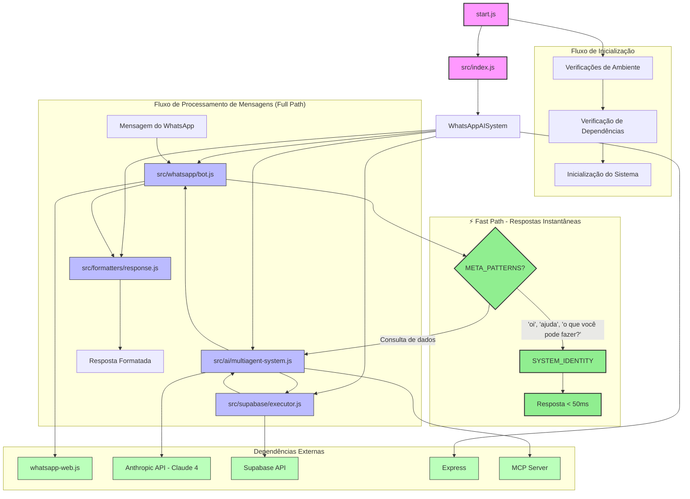

# Diagrama de Relações e Fluxo - AI Data Scientist AICODEPRO

## Explicação do Fluxo de Execução

### 1. **Inicialização do Sistema**
- `start.js` é o ponto de entrada que verifica o ambiente, dependências e configurações
- `start.js` carrega o arquivo `.env` e verifica variáveis obrigatórias
- Após as verificações, `start.js` importa e executa `src/index.js`

### 2. **Estrutura Principal**
- `src/index.js` define a classe `WhatsAppAISystem` que orquestra todos os componentes
- Inicializa os quatro componentes principais: WhatsAppBot, MultiAgentSystem, SupabaseExecutor e ResponseFormatter
- Configura um servidor Express para monitoramento e status

### 3. **⚡ Fast Path (NOVO)**
- **META_PATTERNS**: Regex que detecta perguntas meta/conversacionais
- **SYSTEM_IDENTITY**: Objeto predefinido com identidade, capacidades e tabelas conhecidas
- **Perguntas detectadas**: "o que você pode fazer?", "oi", "ajuda", "status"
- **Benefício**: Resposta em <50ms sem consultar banco de dados

### 4. **Componentes Principais**
- **WhatsAppBot** (`src/whatsapp/bot.js`): Gerencia a conexão com o WhatsApp usando whatsapp-web.js
- **MultiAgentSystem** (`src/ai/multiagent-system.js`): Implementa o sistema de IA com 5 agentes especializados:
  - 🎯 Coordinator Agent - Analisa intenção
  - 📋 Schema Agent - Descobre estrutura
  - 🔍 Query Agent - Constrói e executa SQL
  - 📊 Analyst Agent - Gera insights
  - 💬 Formatter Agent - Formata para WhatsApp
- **SupabaseExecutor** (`src/supabase/executor.js`): Gerencia a conexão e consultas ao Supabase
- **ResponseFormatter** (`src/formatters/response.js`): Formata as respostas para envio ao WhatsApp

### 5. **Fluxo de Processamento de Mensagens**
1. Mensagem recebida pelo WhatsAppBot
2. **Fast Path Check**: Verifica se é pergunta meta
   - **SIM**: Responde instantaneamente via SYSTEM_IDENTITY
   - **NÃO**: Segue para Full Path (5 agentes)
3. MultiAgentSystem analisa a intenção e consulta o SupabaseExecutor
4. Resposta é formatada pelo ResponseFormatter
5. WhatsAppBot envia a resposta formatada de volta ao usuário

### 6. **Dependências Externas**
- **whatsapp-web.js**: Comunicação com WhatsApp
- **Anthropic API (Claude 4)**: Processamento de linguagem natural
- **Supabase**: Armazenamento e consulta de dados PostgreSQL
- **MCP Server**: Execução de SQL via Model Context Protocol
- **Express**: Servidor web de monitoramento
